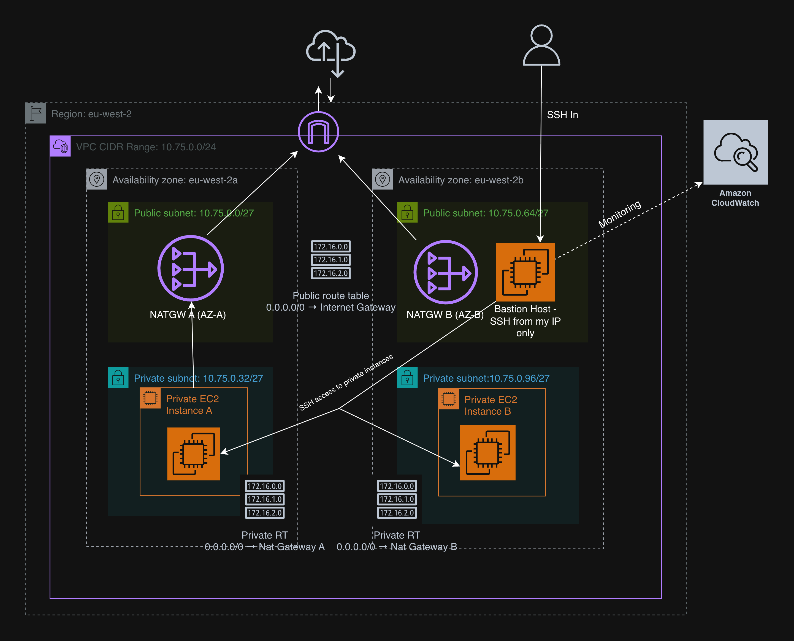

# AWS Secure Multi-AZ VPC with Public and Private Subnets
This project demonstrates a production grade AWS network architecture. It implements network isolation using public and private subnets, achieves high availability through multiple Availability Zones, and provides a secure administrative access path to private EC2 instances. The design reflects core cloud networking principles used in real world environments.

## Architecture Diagram

## How It Works

• **The Virtual Private Cloud (VPC)** spans two Availability Zones, with each AZ containing both a public and a private subnet. Public subnets provide controlled access to the internet, while private subnets host application workloads that are not directly exposed.

• **Public subnets** are associated with a route table that directs outbound traffic to an Internet Gateway. These subnets host the NAT Gateways and a bastion host, enabling secure outbound connectivity and controlled administrative access without exposing private resources.

• **Private subnets** contain EC2 instances with no public IP addresses. Outbound internet access from these instances is routed through a NAT Gateway located in the same Availability Zone, ensuring resilience and avoiding cross-AZ dependencies. Inbound access to private instances is restricted to SSH traffic exclusively from the bastion host.

• **NAT Gateways** allow private EC2 instances to initiate outbound connections for tasks such as package updates, while preventing unsolicited inbound traffic from the internet.

•The **bastion host** acts as the single administrative entry point into the private network. It resides in a public subnet and enables secure SSH access to private EC2 instances using security group–based rules.

• **Amazon CloudWatch** provides monitoring and observability by collecting metrics and logs from EC2 instances, allowing visibility into system health

##Design Reasoning

This design prioritizes security, availability, and simplicity while following AWS best practices.

- Public and private subnet separation enforces network isolation and reduces likelihood of unauthorised access.
- Distributing resources across multiple Availability Zones improves fault tolerance and resilience against AZ failures.
- Deploying one NAT Gateway per Availability Zone removes single points of failure.
- Restricting administrative access through a bastion host provides a controlled and secure access path to private resources.
